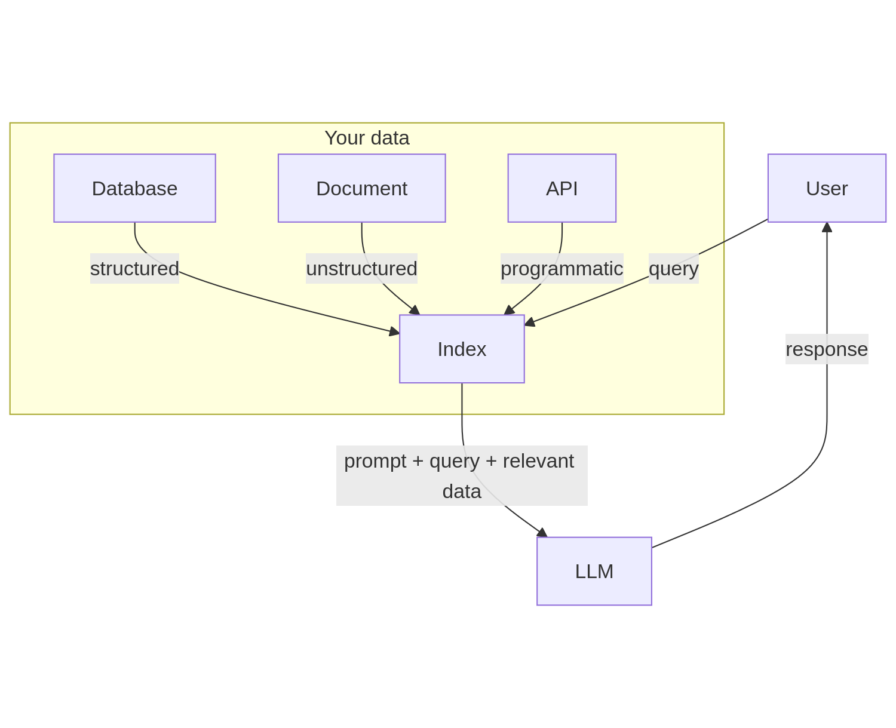
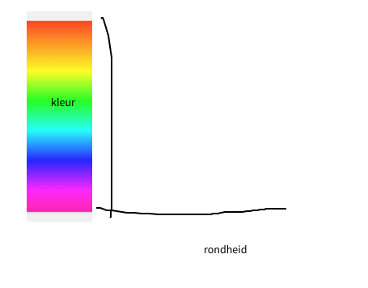
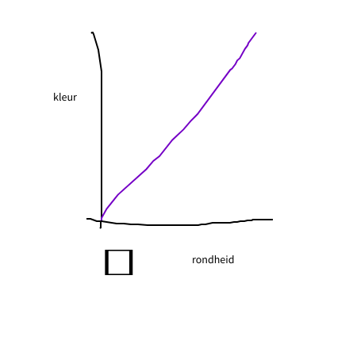
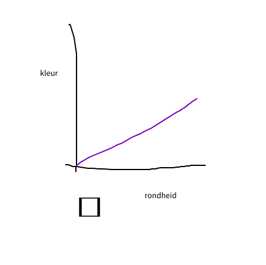
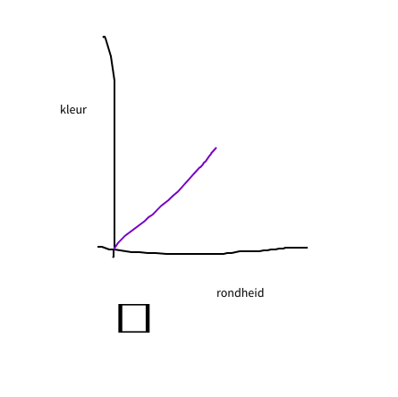
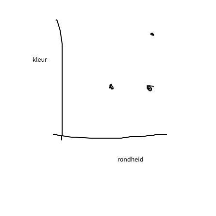
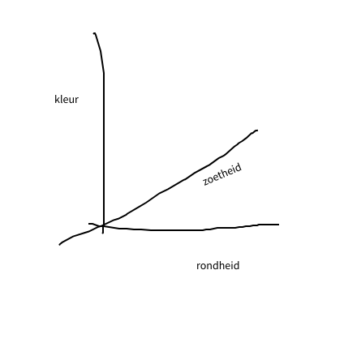
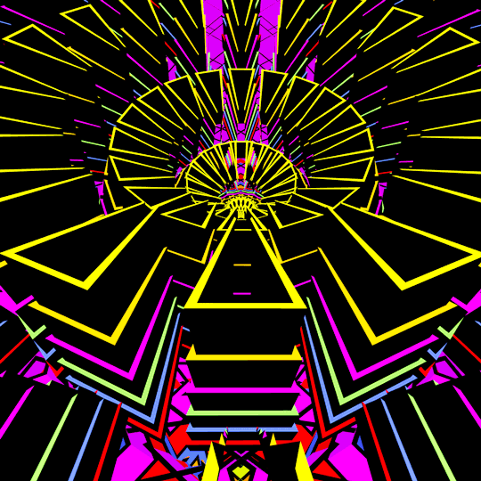
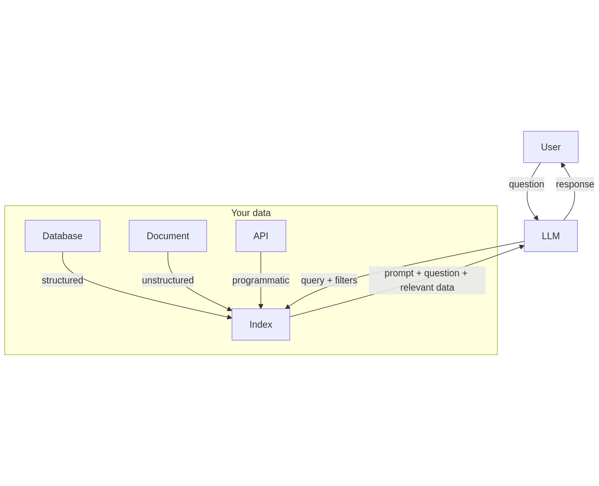

---
author:
  - Bèr `berkes` Kessels
title: "LLMs in de Praktijk"
subtitle: "Integratie van Language Models in Applicaties"
abstract: "Een praktische verkenning van het integreren van Language Models in applicaties, aan de hand van drie cases uit Pathfounder, een virtuele sales coach."
keywords:
  - LLM
  - AI
  - RAG
  - Embeddings
  - Pathfounder
title-slide-attributes:
    data-background-image: 
    data-background-size: cover
lang: nl
---

# LLMs in de Praktijk {background-image="./dancing-bird.gif"}

## Over deze presentatie

* Is online: [berk.es/llm-in-de-praktijk-2024](https://berk.es/llm-in-de-praktijk-2024) (github.com/berkes/llm-in-de-praktijk-2024)
* Bevat alle links, code en voorbeelden
* Is in het Nederlands

## Over mij {background-image="./ber.jpg"}

* Bèr `berkes` Kessels
* @berkes - LinkedIn, Fediverse, Reddit, etc.
* Werkt aan Pathfounder
* Blog berk.es

## Doel

* Praktische kennis over LLM integratie delen
* Drie concrete use-cases uit de praktijk tonen
* Valkuilen en oplossingen bespreken
* Best practices meegeven

## Case 1: Voorspelbare Content

Gecontroleerde Content Generatie

* Pathfounder use-case: sales-oefeningen
* Multishot templates
* LangChain pipeline demo

## Case 2: Bulk Analyse

CSV Verwerking

* Analyse van sales-gesprekken
* TypeScript + OpenAI implementatie
* Demonstratie: samenvatten en categoriseren

## Case 3: Kennisbank Chatbot

## RAG Architectuur

* Embeddings uitgelegd
* Vector zoeken
* Retrieval proces

## RAG Architectuur naief

* Retrieval
* Augmented
* Generation

***

Gebruiker: "Wat moet ik voorbereiden?"

`SELECT documents WHERE content ILIKE "%wat moet ik voorbereiden%" ORDER BY created_at`

`Je bent een supportmedewerker. Beantwoord deze vraag: {vraag}. Gebruik deze kennis: {documents.join()}`

***

## Embeddings

***

`[95,95]`

***

`[50,95]`

***

`[50,55]`

***

`[75, 30] -> ([50,95], [50,55], [95,95])`

***

`[0.8, 0.50, 0.75]`

***

`[0.8, 0.50, 0.75, 0.89, 0.12, ...]`
## RAG Architectuur verbeterd

## Live demo RAG

## Best Practices

## Kostenbeheersing

* Token optimalisatie
* Caching strategieën
* Model selectie

## Instabiliteit

* API wijzigingen
* Model updates
* Versie beheer van prompts
* Fallback strategieën

## Context Vervuiling

* Prompt injection
* Hallucinations
* Input validatie

## Architectuur Flexibiliteit

* Model-agnostisch ontwerp
* Revisiebeheer prompts en parameters
* Modulaire opzet

## Resources

* [OpenAI documentatie](https://platform.openai.com/docs)
* [LangChain documentatie](https://js.langchain.com/docs)
* [Pathfounder Kennisbank](https://docs.pathfounder.nl)

## Vragen?

* Twitter: @berkes
* Email: ber@berk.es
* LinkedIn: /in/berkessels
